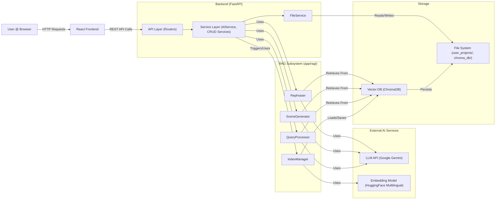

# Codex AI - System Architecture

This document outlines the architecture of the Codex AI application.

## 1. Overview

Codex AI is a web application designed to assist creative writers. It combines a React frontend for user interaction with a FastAPI backend for managing project data, orchestrating AI tasks, and handling persistence. The core AI functionality relies on Retrieval-Augmented Generation (RAG) using LlamaIndex, a Google Gemini LLM, a multilingual HuggingFace embedding model, and a ChromaDB vector store.

## 2. Architecture Diagram

The system follows a typical client-server architecture with distinct components for the user interface, backend logic, AI orchestration, and data storage.

**Flow Description:**

1.  The **User** interacts with the **React Frontend**.
    
2.  The **Frontend** sends REST API calls to the **FastAPI Backend**.
    
3.  The **Backend API** routes requests to the appropriate **Service** (e.g., ProjectService, AIService).
    
4.  **Services** orchestrate business logic:
    
    -   For CRUD operations, they use FileService to interact with Markdown files and metadata (project_meta.json, etc.) on the **File System**.
        
    -   FileService triggers the IndexManager (part of the **RAG Subsystem**) upon saving relevant content (.md files).
        
    -   For AI tasks (Query, Generate, Rephrase), AIService loads necessary explicit context (like Plan, Synopsis, previous scenes) using FileService and then delegates the core AI logic to specific processors (QueryProcessor, SceneGenerator, Rephraser) within the **RAG Subsystem**, passing both explicit and retrieved context as needed.
        
5.  **RAG Subsystem:**
    
    -   IndexManager: Handles LlamaIndex setup, loads/updates/deletes documents in the **Vector DB (ChromaDB)**, generates embeddings via the **Embedding Model (HuggingFace)**, and injects project_id and other metadata.
        
    -   QueryProcessor, SceneGenerator, Rephraser: Use components initialized by IndexManager. They perform RAG retrieval (querying the **Vector DB** with project_id filters), construct prompts using retrieved context and any explicit context passed from AIService, call the **LLM API (Google Gemini)**, and process the response.
        
6.  Responses flow back through the layers to the user.
    

## 3. Component Breakdown

### 3.1. Frontend (React)

-   **Technology:** React, JavaScript/JSX, CSS, Axios, react-router-dom, @uiw/react-md-editor.
    
-   **UI Components:** Standard React components, AIEditorWrapper for Markdown editing with AI features.
    
-   **Responsibilities:** UI rendering, user input, client-state management, API communication.
    

### 3.2. Backend (FastAPI)

-   **Technology:** Python, FastAPI, Pydantic, pip-tools (for dependency locking).
    
-   **Responsibilities:** REST API, routing, data validation, service orchestration, error handling.
    
-   **Structure:** Layered (API -> Services -> RAG/Utilities). Includes AIService for AI logic orchestration.
    

### 3.3. RAG Subsystem (app/rag/)

-   **Technology:** LlamaIndex library (Python).
    
-   **Components:**
    
    -   **IndexManager:**
        
        -   Initializes LlamaIndex components (LLM, Embeddings, VectorStore, StorageContext).
            
        -   Handles index modification: loading documents, parsing, embedding (via **Embedding Model**), injecting metadata, and inserting/updating/deleting nodes in the **Vector DB**.
            
    -   **QueryProcessor:** Performs RAG queries, incorporating explicit Plan/Synopsis context alongside retrieved nodes before calling the LLM.
        
    -   **SceneGenerator:** Generates scene drafts using explicit context (Plan, Synopsis, previous scenes) and retrieved RAG context.
        
    -   **Rephraser:** Provides rephrasing suggestions using selected text, surrounding text, and retrieved RAG context.
        
    -   **(Future)**  PromptBuilder (potential abstraction for prompt logic).
        
-   **Abstraction:** Leverages LlamaIndex interfaces (LLM, VectorStore, BaseEmbedding) for potential future component swapping.
    

### 3.4. Services (app/services/)

-   **Technology:** Python.
    
-   **Responsibilities:** Encapsulate business logic for each domain (Projects, Chapters, Scenes, Characters, AI).
    
    -   CRUD services use FileService for persistence and metadata.
        
    -   AIService loads explicit context via FileService and orchestrates calls to the RAG processors.
        
    -   FileService: Centralizes all direct file system interactions (reading/writing text/JSON, creating/deleting files/dirs) and triggers IndexManager for relevant file changes. Also handles metadata I/O.
        

### 3.5. LLM Service (Google Gemini)

-   **Technology:** External API (Google Generative AI). Accessed via llama-index-llms-google-genai.
    
-   **Responsibilities:** Natural language understanding, text generation based on context provided by RAG processors.
    

### 3.6. Embedding Service (HuggingFace Multilingual)

-   **Technology:** HuggingFace sentence-transformers library (running locally). Model: sentence-transformers/paraphrase-multilingual-mpnet-base-v2.
    
-   **Responsibilities:** Convert text chunks into vector embeddings suitable for multilingual semantic search. Used by IndexManager.
    

### 3.7. Vector Database (ChromaDB)

-   **Technology:** ChromaDB (Python library, local persistence).
    
-   **Responsibilities:** Store text chunks (nodes) with their embeddings and metadata (including project_id, file_path, character_name). Perform efficient vector similarity searches with metadata filtering. Accessed via LlamaIndex ChromaVectorStore adapter.
    

### 3.8. Data Storage (File System)

-   **Technology:** Server's local file system (user_projects/ directory).
    
-   **Responsibilities:** Persist user project content (Markdown files) and project/chapter metadata (project_meta.json, chapter_meta.json). This is the primary source of truth for user content.
    
-   **Note:** ChromaDB also persists its data to the file system (chroma_db/ directory), managed separately.
    

## 4. Key Workflows

### 4.1. Content Indexing (RAG - Ingestion)

1.  User saves/updates a Markdown file via Frontend -> Backend API -> Service.
    
2.  Service calls FileService to write the .md file to the File System.
    
3.  FileService triggers IndexManager.index_file(path).
    
4.  IndexManager:
    
    -   Loads the document.
        
    -   Extracts project_id from the path.
        
    -   Checks if it's a character file and retrieves character name from metadata via FileService.
        
    -   Parses document into Nodes (implicitly by LlamaIndex).
        
    -   Injects project_id, file_path, and potentially character_name into each Node's metadata.
        
    -   Generates embeddings for Nodes via the configured **Embedding Model (HuggingFace)**.
        
    -   Deletes existing nodes for this doc_id (file path) from **Vector DB**.
        
    -   Inserts new Nodes with embeddings and metadata into **Vector DB**.
        

### 4.2. AI Query (RAG - Retrieval & Synthesis)

1.  User submits query via Frontend -> Backend API (/ai/query/{project_id}) -> AIService.
    
2.  AIService.query_project:
    
    -   Calls FileService to load explicit Plan and Synopsis content.
        
    -   Calls QueryProcessor.query(project_id, query_text, explicit_plan, explicit_synopsis).
        
3.  QueryProcessor:
    
    -   Creates VectorIndexRetriever with MetadataFilters for the given project_id.
        
    -   Retrieves relevant nodes from **Vector DB** using the retriever.
        
    -   Constructs a detailed prompt including the user query, explicit Plan/Synopsis, and the content of retrieved nodes.
        
    -   Calls the **LLM API (Google Gemini)** directly with the combined prompt.
        
    -   Extracts the answer string from the LLM response.
        
    -   Returns (answer, retrieved_nodes) tuple to AIService.
        
4.  AIService returns the tuple to the API endpoint.
    
5.  API endpoint formats the retrieved_nodes into SourceNodeModel list.
    
6.  API endpoint returns AIQueryResponse (containing answer and source_nodes) to the Frontend.
    
7.  Frontend displays the response to the User.
    

### 4.3. AI Scene Generation (RAG)

1.  User clicks "Add Scene using AI" on Frontend -> Backend API (/ai/generate/scene/...) -> AIService.
    
2.  AIService.generate_scene_draft:
    
    -   Calls FileService to load explicit Plan, Synopsis, and previous scene(s) content based on PREVIOUS_SCENE_COUNT.
        
    -   Calls SceneGenerator.generate_scene(...), passing the loaded explicit context.
        
3.  SceneGenerator:
    
    -   Creates VectorIndexRetriever with MetadataFilters for the project_id.
        
    -   Retrieves relevant nodes from **Vector DB**.
        
    -   Constructs a prompt including the user prompt (if any), explicit Plan/Synopsis/previous scenes, and retrieved nodes.
        
    -   Calls the **LLM API (Google Gemini)**.
        
    -   Returns the generated Markdown string to AIService.
        
4.  AIService returns the generated content in AISceneGenerationResponse to the Frontend.
    
5.  Frontend displays the draft in a modal.
    

## 5. Design Decisions & Principles

-   **API-First:** Decoupled Frontend/Backend.
    
-   **Layered Architecture:** Clear separation (API -> Service -> RAG/Utilities).
    
-   **Separation of Concerns (RAG):**  IndexManager handles index lifecycle/setup, specific processors (QueryProcessor, SceneGenerator, Rephraser) handle different AI tasks. AIService orchestrates and loads explicit context.
    
-   **Explicit Context Management:** Project isolation achieved via mandatory project_id metadata injection and filtering during retrieval. Explicit Plan/Synopsis/Scenes passed when necessary.
    
-   **Async Backend:** FastAPI for efficient I/O.
    
-   **Modularity & Extensibility:** LlamaIndex abstractions.
    
-   **Markdown as Source of Truth:** User content remains portable.
    
-   **Centralized File I/O:**  FileService manages all disk access and triggers indexing.
    
-   **DRY:** Metadata I/O centralized in FileService.
    
-   **Reproducible Dependencies:**  pip-tools (requirements.in, requirements.txt) used for backend dependency locking.
    

## 6. Data Storage Summary

-   **User Content & Core Metadata:** Markdown files and project_meta.json/chapter_meta.json in user_projects/. **Excluded from Git.**
    
-   **Vector Embeddings & Index:** Managed by ChromaDB, persisted in chroma_db/. **Excluded from Git.**
    
-   **Application Configuration:**  .env file (excluded from Git).
    
-   **Dependency Lock Files:**  backend/requirements.txt (generated, committed to Git), frontend/package-lock.json (or yarn.lock, committed to Git).
    

## 7. Deployment (Future Consideration)
Maybe Docker
