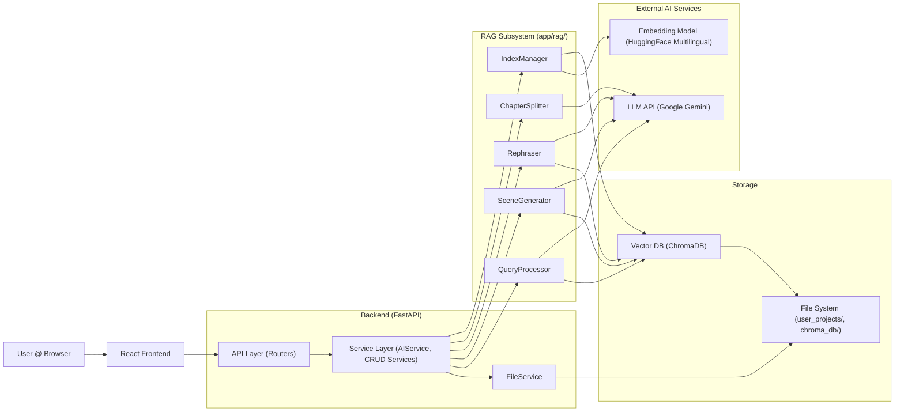

# Codex AI - System Architecture

This document outlines the architecture of the Codex AI application.

## 1. Overview

Codex AI is a web application designed to assist creative writers. It combines a React frontend for user interaction with a FastAPI backend for managing project data, orchestrating AI tasks, and handling persistence. The core AI functionality relies on Retrieval-Augmented Generation (RAG) using LlamaIndex, a Google Gemini LLM, a multilingual HuggingFace embedding model, and a ChromaDB vector store. Users can manage multiple independent chat sessions within each project.

## 2. Architecture Diagram

The system follows a typical client-server architecture with distinct components for the user interface, backend logic, AI orchestration, and data storage.

**Flow Description:**

1.  The **User** interacts with the **React Frontend**.
    
2.  The **Frontend** sends REST API calls to the **FastAPI Backend**.
    
3.  The **Backend API** routes requests to the appropriate **Service** (e.g., ProjectService, AIService, ChatHistoryService).
    
4.  **Services** orchestrate business logic:
    
    -   For CRUD operations (Projects, Chapters, Characters, Scenes, Chat Sessions), they use FileService to interact with Markdown files and metadata (project_meta.json, chapter_meta.json, chat_history.json) on the **File System**.
        
    -   FileService triggers the IndexManager (part of the **RAG Subsystem**) upon saving relevant content (.md files).
        
    -   For AI tasks (Query, Generate, Rephrase, Split), AIService loads necessary explicit context (like Plan, Synopsis, previous scenes) using FileService and then delegates the core AI logic to specific processors (QueryProcessor, SceneGenerator, Rephraser, ChapterSplitter) within the **RAG Subsystem**, passing both explicit and retrieved context as needed.
        
    -   Chat history operations are handled per session via dedicated API endpoints and FileService methods.
        
5.  **RAG Subsystem:**
    
    -   IndexManager: Handles LlamaIndex setup, loads/updates/deletes documents in the **Vector DB (ChromaDB)**, generates embeddings via the **Embedding Model (HuggingFace)**, and injects project_id and other metadata.
        
    -   QueryProcessor, SceneGenerator, Rephraser, ChapterSplitter: Use components initialized by IndexManager. They perform RAG retrieval (querying the **Vector DB** with project_id filters), construct prompts using retrieved context and any explicit context passed from AIService, call the **LLM API (Google Gemini)**, and process the response.
        
6.  Responses flow back through the layers to the user.
    

## 3. Component Breakdown

### 3.1. Frontend (React)

-   **Technology:** React, Vite, JavaScript/JSX, CSS, Axios, react-router-dom, @uiw/react-md-editor.
    
-   **UI Components:** Standard React components, AIEditorWrapper for Markdown editing with AI features, ProjectQueryPage manages chat session UI.
    
-   **Responsibilities:** UI rendering, user input, client-state management (including active chat session), API communication.
    

### 3.2. Backend (FastAPI)

-   **Technology:** Python, FastAPI, Pydantic, pip-tools (for dependency locking).
    
-   **Responsibilities:** REST API, routing, data validation, service orchestration, error handling.
    
-   **Structure:** Layered (API -> Services -> RAG/Utilities). Includes AIService for AI logic orchestration, CRUD services, and dedicated chat history/session endpoints.
    

### 3.3. RAG Subsystem (app/rag/)

-   **Technology:** LlamaIndex library (Python).
    
-   **Components:**
    
    -   **IndexManager:** Initializes LlamaIndex components, handles index modification (CRUD), embedding generation, metadata injection.
        
    -   **QueryProcessor:** Performs RAG queries, incorporating explicit context.
        
    -   **SceneGenerator:** Generates scene drafts using explicit and RAG context.
        
    -   **Rephraser:** Provides rephrasing suggestions using context.
        
    -   **ChapterSplitter:** Proposes scene splits based on chapter content.
        
-   **Abstraction:** Leverages LlamaIndex interfaces.
    

### 3.4. Services (app/services/)

-   **Technology:** Python.
    
-   **Responsibilities:** Encapsulate business logic.
    
    -   CRUD services (Project, Chapter, Character, Scene) use FileService for persistence and metadata.
        
    -   AIService loads explicit context via FileService and orchestrates calls to the RAG processors.
        
    -   FileService: Centralizes file system interactions (Markdown, JSON metadata including project_meta.json, chapter_meta.json, chat_history.json), triggers IndexManager.
        

### 3.5. LLM Service (Google Gemini)

-   **Technology:** External API (Google Generative AI).
    
-   **Responsibilities:** NLU, text generation.
    

### 3.6. Embedding Service (HuggingFace Multilingual)

-   **Technology:** HuggingFace sentence-transformers library (local).
    
-   **Responsibilities:** Convert text to vector embeddings.
    

### 3.7. Vector Database (ChromaDB)

-   **Technology:** ChromaDB (Python library, local persistence).
    
-   **Responsibilities:** Store embeddings and metadata, perform vector search with filtering.
    

### 3.8. Data Storage (File System)

-   **Technology:** Server's local file system (user_projects/).
    
-   **Responsibilities:** Persist user content (Markdown), project/chapter metadata (project_meta.json, chapter_meta.json), and chat session history (chat_history.json).
    
-   **Note:** ChromaDB also persists its data (chroma_db/).
    

## 4. Key Workflows

### 4.1. Content Indexing (RAG - Ingestion)

(No significant changes, IndexManager handles metadata)

### 4.2. AI Query (RAG - Retrieval & Synthesis)

1.  User submits query via Frontend -> Backend API (/ai/query/{project_id}) -> AIService.
    
2.  AIService.query_project:
    
    -   Calls FileService to load explicit Plan and Synopsis content.
        
    -   Identifies potential direct source entities (Characters, Scenes, Notes) mentioned in the query via FileService/metadata.
        
    -   Loads content for directly mentioned entities via FileService.
        
    -   Determines paths to filter from RAG retrieval (Plan, Synopsis, directly loaded content).
        
    -   Calls QueryProcessor.query(...), passing explicit context, direct source content, and filter paths.
        
3.  QueryProcessor:
    
    -   Retrieves relevant nodes from **Vector DB** (filtering by project_id and excluding filtered paths).
        
    -   Constructs a prompt including query, explicit context, direct source content, and retrieved nodes.
        
    -   Calls the **LLM API**.
        
    -   Returns (answer, retrieved_nodes, direct_source_info) tuple to AIService.
        
4.  AIService returns the tuple to the API endpoint.
    
5.  API endpoint formats the response.
    
6.  Frontend displays the response (separating direct vs. retrieved sources if needed).
    

### 4.3. AI Scene Generation (RAG)

(No significant changes, uses explicit context + RAG)

### 4.4. AI Chapter Splitting

(No significant changes, uses explicit context + RAG)

### 4.5. Chat Session Management

1.  User interacts with session UI (dropdown, buttons) in Frontend (ProjectQueryPage).
    
2.  Frontend calls relevant Backend API endpoints (/projects/{projectId}/chat_sessions/... or /projects/{projectId}/chat_history/{sessionId}).
    
3.  API routes to chat_history.py endpoints.
    
4.  Endpoints use FileService methods (get_chat_sessions_metadata, add_chat_session_metadata, read_chat_session_history, write_chat_session_history, etc.) to interact with project_meta.json (for session names) and chat_history.json (for history content).
    
5.  FileService reads/writes the JSON files on the **File System**.
    
6.  Responses are sent back to the Frontend, which updates its state (sessions, activeSessionId, chat history).
    

## 5. Design Decisions & Principles

-   **API-First:** Decoupled Frontend/Backend.
    
-   **Layered Architecture:** API -> Service -> RAG/Utilities.
    
-   **Separation of Concerns (RAG):** IndexManager, specific RAG processors, AIService orchestration.
    
-   **Explicit Context Management:** Project isolation via metadata filtering; explicit context passed when needed.
    
-   **Async Backend:** FastAPI.
    
-   **Modularity & Extensibility:** LlamaIndex abstractions.
    
-   **Markdown as Source of Truth:** User content remains portable.
    
-   **Centralized File I/O:** FileService manages disk access, metadata, chat history, and triggers indexing.
    
-   **DRY:** Metadata I/O centralized.
    
-   **Reproducible Dependencies:** pip-tools.
    

## 6. Data Storage Summary

-   **User Content & Core Metadata:** Markdown files and project_meta.json/chapter_meta.json in user_projects/. **Excluded from Git.**
    
-   **Chat History:** Stored per-project in user_projects/{project_id}/chat_history.json. Session metadata stored within project_meta.json. **Excluded from Git.**
    
-   **Vector Embeddings & Index:** Managed by ChromaDB, persisted in chroma_db/. **Excluded from Git.**
    
-   **Application Configuration:**  .env file (excluded from Git).
    
-   **Dependency Lock Files:**  backend/requirements.txt, frontend/package-lock.json (committed to Git).
    

## 7. Deployment (Future Consideration)

Maybe Docker
