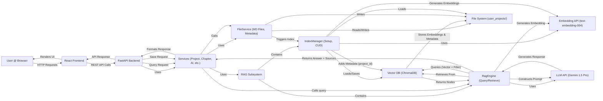

The system follows a typical client-server architecture with distinct components for the user interface, backend logic, AI orchestration, and data storage.
mermaid

    

**Flow Description:**

1.  The **User** interacts with the **React Frontend**.
    
2.  The **Frontend** sends REST API calls to the **FastAPI Backend**.
    
3.  The **Backend API** routes requests to the appropriate **Service** (e.g., ProjectService, AIService).
    
4.  **Services** orchestrate business logic:
    
    -   For CRUD operations, they use FileService to interact with Markdown files and metadata (project_meta.json, etc.) on the **File System**.
        
    -   FileService triggers the IndexManager (part of the **RAG Subsystem**) upon saving relevant content (.md files).
        
    -   For AI queries, AIService uses the RagEngine (also part of the **RAG Subsystem**).
        
5.  **RAG Subsystem:**
    
    -   IndexManager: Handles LlamaIndex setup, loads/updates/deletes documents in the **Vector DB (ChromaDB)**, generates embeddings via the **Embedding API**, and injects project_id metadata.
        
    -   RagEngine: Handles queries by creating a retriever filtered by project_id, querying the **Vector DB**, constructing prompts with retrieved context, calling the **LLM API**, and returning the answer and source nodes.
        
6.  Responses flow back through the layers to the user.
    

## 3. Component Breakdown

### 3.1. Frontend (React)

-   **Technology:** React, JavaScript/JSX, CSS, Axios.
    
-   **UI Components:** Standard React components, @uiw/react-md-editor.
    
-   **Responsibilities:** UI rendering, user input, client-state management, API communication. (AI query UI pending).
    

### 3.2. Backend (FastAPI)

-   **Technology:** Python, FastAPI, Pydantic.
    
-   **Responsibilities:** REST API, routing, data validation, service orchestration, error handling.
    
-   **Structure:** Layered (API -> Services -> Utilities/RAG). Includes AIService for AI logic orchestration.
    

### 3.3. RAG Subsystem (app/rag/)

-   **Technology:** LlamaIndex library (Python).
    
-   **Components:**
    
    -   **IndexManager:**
        
        -   Initializes LlamaIndex components (LLM, Embeddings, VectorStore, StorageContext).
            
        -   Handles index modification: loading documents, parsing, embedding (via **Embedding API**), injecting project_id metadata, and inserting/updating/deleting nodes in the **Vector DB**.
            
    -   **RagEngine:**
        
        -   Uses components initialized by IndexManager.
            
        -   Performs RAG queries: Creates VectorIndexRetriever with MetadataFilters (for project_id), uses RetrieverQueryEngine to combine retrieval and **LLM API** calls, processes the response to extract the answer and source nodes.
            
-   **Abstraction:** Leverages LlamaIndex interfaces (LLM, VectorStore, BaseEmbedding) for potential future component swapping.
    

### 3.4. Services (app/services/)

-   **Technology:** Python.
    
-   **Responsibilities:** Encapsulate business logic for each domain (Projects, Chapters, Scenes, Characters, AI).
    
    -   CRUD services use FileService for persistence and metadata.
        
    -   AIService uses RagEngine for AI tasks.
        
    -   FileService: Centralizes all direct file system interactions (reading/writing text/JSON, creating/deleting files/dirs) and triggers IndexManager for relevant file changes. Also handles metadata I/O.
        

### 3.5. LLM Service (Google Gemini 1.5 Pro)

-   **Technology:** External API (Google Generative AI).
    
-   **Responsibilities:** Natural language understanding, text generation based on context provided by RagEngine.
    

### 3.6. Embedding Service (Google text-embedding-004)

-   **Technology:** External API (Google Generative AI).
    
-   **Responsibilities:** Convert text chunks into vector embeddings for semantic search. Used by IndexManager.
    

### 3.7. Vector Database (ChromaDB)

-   **Technology:** ChromaDB (Python library, local persistence).
    
-   **Responsibilities:** Store text chunks (nodes) with their embeddings and metadata (including project_id, file_path). Perform efficient vector similarity searches with metadata filtering. Accessed via LlamaIndex ChromaVectorStore adapter.
    

### 3.8. Data Storage (File System)

-   **Technology:** Server's local file system (user_projects/ directory).
    
-   **Responsibilities:** Persist user project content (Markdown files) and project/chapter metadata (project_meta.json, chapter_meta.json). This is the primary source of truth for user content.
    
-   **Note:** ChromaDB also persists its data to the file system (chroma_db/ directory), managed separately.
    

## 4. Key Workflows

### 4.1. Content Indexing (RAG - Ingestion)

1.  User saves/updates a Markdown file via Frontend -> Backend API -> Service.
    
2.  Service calls FileService to write the .md file to the File System.
    
3.  FileService triggers IndexManager.index_file(path).
    
4.  IndexManager:
    
    -   Loads the document.
        
    -   Extracts project_id from the path.
        
    -   Parses document into Nodes.
        
    -   Injects project_id and file_path into each Node's metadata.
        
    -   Generates embeddings for Nodes via **Embedding API**.
        
    -   Deletes existing nodes for this doc_id (file path) from **Vector DB**.
        
    -   Inserts new Nodes with embeddings and metadata into **Vector DB**.
        

### 4.2. AI Query (RAG - Retrieval & Synthesis)

1.  User submits query via Frontend -> Backend API (/ai/query/{project_id}) -> AIService.
    
2.  AIService.query_project calls RagEngine.query(project_id, query_text).
    
3.  RagEngine:
    
    -   Creates VectorIndexRetriever with MetadataFilters for the given project_id.
        
    -   Creates RetrieverQueryEngine using the filtered retriever and the configured LLM.
        
    -   Executes await query_engine.aquery(query_text).
        
        -   (Internal LlamaIndex flow: query embedding -> filtered vector search in ChromaDB -> retrieve top-K nodes -> construct prompt -> call LLM API -> get response)
            
    -   Extracts the answer string and source_nodes list from the LLM response object.
        
    -   Returns (answer, source_nodes) tuple to AIService.
        
4.  AIService returns the tuple to the API endpoint.
    
5.  API endpoint formats the source_nodes into SourceNodeModel list.
    
6.  API endpoint returns AIQueryResponse (containing answer and source_nodes) to the Frontend.
    
7.  Frontend displays the response to the User. (UI pending)
    

## 5. Design Decisions & Principles

-   **API-First:** Decoupled Frontend/Backend.
    
-   **Layered Architecture:** Clear separation (API -> Service -> RAG/Utilities).
    
-   **Separation of Concerns (RAG):**  IndexManager handles index lifecycle/setup, RagEngine handles querying/retrieval.
    
-   **Explicit Context Management:** Project isolation achieved via mandatory project_id metadata injection and filtering during retrieval.
    
-   **Async Backend:** FastAPI for efficient I/O.
    
-   **Modularity & Extensibility:** LlamaIndex abstractions.
    
-   **Markdown as Source of Truth:** User content remains portable.
    
-   **Centralized File I/O:**  FileService manages all disk access and triggers indexing.
    
-   **DRY:** Metadata I/O centralized in FileService.
    

## 6. Data Storage Summary

-   **User Content & Core Metadata:** Markdown files and project_meta.json/chapter_meta.json in user_projects/. **Excluded from Git.**
    
-   **Vector Embeddings & Index:** Managed by ChromaDB, persisted in chroma_db/. **Excluded from Git.**
    
-   **Application Configuration:**  .env file (excluded from Git).
    

## 7. Deployment (Future Consideration)

(Remains the same - Docker likely strategy)
