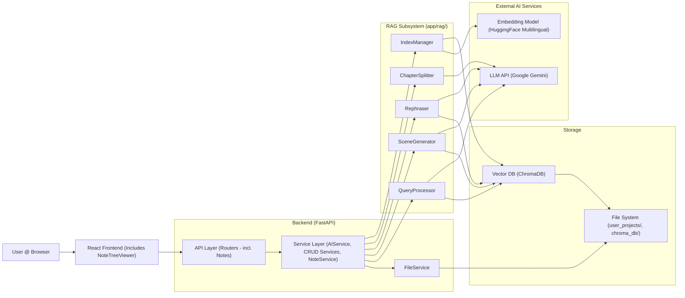

# Codex AI - System Architecture

This document outlines the architecture of the Codex AI application.

## 1. Overview

Codex AI is a web application designed to assist creative writers. It combines a React frontend for user interaction with a FastAPI backend for managing project data, orchestrating AI tasks, and handling persistence. The core AI functionality relies on Retrieval-Augmented Generation (RAG) using LlamaIndex, a Google Gemini LLM, a multilingual HuggingFace embedding model, and a ChromaDB vector store. Users can manage multiple independent chat sessions and organize project-level notes within each project.

## 2. Architecture Diagram

The system follows a typical client-server architecture with distinct components for the user interface, backend logic, AI orchestration, and data storage.

**Flow Description:**

1.  The **User** interacts with the **React Frontend**, including components like NoteTreeViewer for managing notes.
    
2.  The **Frontend** sends REST API calls to the **FastAPI Backend**.
    
3.  The **Backend API** routes requests to the appropriate **Service** (e.g., ProjectService, ChapterService, NoteService, AIService, ChatHistoryService).
    
4.  **Services** orchestrate business logic:
    
    -   For CRUD operations (Projects, Chapters, Characters, Scenes, Notes, Chat Sessions), they use FileService to interact with Markdown files and metadata (project_meta.json, chapter_meta.json, chat_history.json) on the **File System**. NoteService specifically handles note creation/deletion/updates and virtual folder operations (rename/delete) by manipulating metadata in project_meta.json.
        
    -   FileService triggers the IndexManager (part of the **RAG Subsystem**) upon saving relevant content (.md files, including notes).
        
    -   For AI tasks (Query, Generate, Rephrase, Split), AIService loads necessary explicit context (like Plan, Synopsis, previous scenes, Notes) using FileService and then delegates the core AI logic to specific processors (QueryProcessor, SceneGenerator, Rephraser, ChapterSplitter) within the **RAG Subsystem**, passing both explicit and retrieved context as needed.
        
    -   Chat history operations are handled per session via dedicated API endpoints and FileService methods.
        
    -   For Chapter Compilation, ChapterService fetches scene data via SceneService and compiles the content.
        
    -   For the Notes Tree View, NoteService reads metadata and file modification times via FileService to construct the hierarchical tree structure. Frontend drag-and-drop operations trigger API calls to NoteService (e.g., updateNote for moving notes, renameFolder for moving folders).
        
5.  **RAG Subsystem:**
    
    -   IndexManager: Handles LlamaIndex setup, loads/updates/deletes documents (including notes) in the **Vector DB (ChromaDB)**, generates embeddings via the **Embedding Model (HuggingFace)**, and injects project_id and other metadata.
        
    -   QueryProcessor, SceneGenerator, Rephraser, ChapterSplitter: Use components initialized by IndexManager. They perform RAG retrieval (querying the **Vector DB** with project_id filters), construct prompts using retrieved context (which can include **Notes**) and any explicit context passed from AIService, call the **LLM API (Google Gemini)**, and process the response.
        
6.  Responses flow back through the layers to the user.
    

## 3. Component Breakdown

### 3.1. Frontend (React)

-   **Technology:** React, Vite, JavaScript/JSX, CSS, Axios, react-router-dom, @uiw/react-md-editor, react-arborist.
    
-   **UI Components:** Standard React components, AIEditorWrapper for Markdown editing with AI features, ProjectQueryPage manages chat session UI, ChapterSection displays chapter/scene info and actions, **ProjectNotesPage** displays the note tree, **NoteEditPage** for editing individual notes, **NoteTreeViewer** for interactive tree display and drag-and-drop.
    
-   **Responsibilities:** UI rendering, user input, client-state management (including active chat session, note tree state), API communication, triggering file downloads (for compilation).
    

### 3.2. Backend (FastAPI)

-   **Technology:** Python, FastAPI, Pydantic, pip-tools (for dependency locking).
    
-   **Responsibilities:** REST API, routing, data validation, service orchestration, error handling.
    
-   **Structure:** Layered (API -> Services -> RAG/Utilities). Includes AIService for AI logic orchestration, CRUD services (including **NoteService**), dedicated chat history/session endpoints, and chapter compilation logic within ChapterService.
    

### 3.3. RAG Subsystem (app/rag/)

-   **Technology:** LlamaIndex library (Python).
    
-   **Components:**
    
    -   **IndexManager:** Initializes LlamaIndex components, handles index modification (CRUD for all content types including notes), embedding generation, metadata injection.
        
    -   **QueryProcessor:** Performs RAG queries, incorporating explicit context (including notes).
        
    -   **SceneGenerator:** Generates scene drafts using explicit and RAG context (including notes).
        
    -   **Rephraser:** Provides rephrasing suggestions using context (including notes).
        
    -   **ChapterSplitter:** Proposes scene splits based on chapter content, using context (including notes).
        
-   **Abstraction:** Leverages LlamaIndex interfaces.
    

### 3.4. Services (app/services/)

-   **Technology:** Python.
    
-   **Responsibilities:** Encapsulate business logic.
    
    -   CRUD services (Project, Chapter, Character, Scene, **Note**) use FileService for persistence and metadata. ChapterService also handles compilation. **NoteService** manages note CRUD, virtual folder operations (rename/delete), and tree structure generation.
        
    -   AIService loads explicit context via FileService and orchestrates calls to the RAG processors.
        
    -   FileService: Centralizes file system interactions (Markdown content, JSON metadata including project_meta.json, chapter_meta.json, chat_history.json), triggers IndexManager.
        

### 3.5. LLM Service (Google Gemini)

-   **Technology:** External API (Google Generative AI).
    
-   **Responsibilities:** NLU, text generation.
    

### 3.6. Embedding Service (HuggingFace Multilingual)

-   **Technology:** HuggingFace sentence-transformers library (local).
    
-   **Responsibilities:** Convert text to vector embeddings.
    

### 3.7. Vector Database (ChromaDB)

-   **Technology:** ChromaDB (Python library, local persistence).
    
-   **Responsibilities:** Store embeddings and metadata, perform vector search with filtering.
    

### 3.8. Data Storage (File System)

-   **Technology:** Server's local file system (user_projects/).
    
-   **Responsibilities:** Persist user content (Markdown for Scenes, Characters, Plan, Synopsis, World, **Notes**), project/chapter metadata (project_meta.json - includes chapter, character, **note metadata**, chat sessions; chapter_meta.json - includes scene metadata), and chat session history (chat_history.json).
    
-   **Note:** ChromaDB also persists its data (chroma_db/).
    

## 4. Key Workflows

### 4.1. Content Indexing (RAG - Ingestion)

1.  User saves content (e.g., Scene, Character Description, Plan, Synopsis, **Note**) via Frontend -> Backend API -> CRUD Service (or **NoteService**).
    
2.  The relevant Service calls FileService.write_text_file (or similar) with trigger_index=True.
    
3.  FileService writes the Markdown file to the **File System** (e.g., into user_projects/{proj_id}/notes/ for notes).
    
4.  FileService checks if trigger_index is true and the file is .md.
    
5.  If conditions met, FileService calls IndexManager.index_file with the file path.
    
6.  IndexManager:
    
    -   Reads the file content.
        
    -   Uses SimpleDirectoryReader with a custom file_metadata_func.
        
    -   file_metadata_func extracts project_id and determines document_type (e.g., 'Note'), document_title (from metadata for notes, or filename), chapter_id, chapter_title based on the file path and project/chapter metadata (read via FileService).
        
    -   LlamaIndex splits the document into text chunks (nodes).
        
    -   IndexManager (via LlamaIndex Settings) uses the **Embedding Model (HuggingFace)** to generate vector embeddings for each chunk.
        
    -   IndexManager inserts the chunks (nodes) along with their embeddings and metadata (including project_id, file_path, document_type, etc.) into the **Vector DB (ChromaDB)** collection. Existing nodes for the same file_path are deleted first to ensure updates.
        

### 4.2. AI Query (RAG - Retrieval & Synthesis)

1.  User submits query via Frontend -> Backend API (/ai/query/{project_id}) -> AIService.
    
2.  AIService.query_project:
    
    -   Calls FileService to load explicit Project Plan and Synopsis content.
        
    -   Compiles a list of project entities (Chapters, Scenes, Characters, **Notes**) by reading metadata via FileService.
        
    -   Checks if the user's query text matches any entity names (case-insensitive, including **Note** titles).
        
    -   If a Chapter entity matches, calls FileService again to load that chapter's Plan and Synopsis (if they exist). This becomes direct_chapter_context.
        
    -   If other entities (Scene, Character, **Note**, World) match, calls FileService to load their content. This becomes direct_sources_data.
        
    -   Determines paths to filter from RAG retrieval (Plan, Synopsis, directly loaded content files, chapter plan/synopsis files).
        
    -   Calls QueryProcessor.query(...), passing the query, explicit project/chapter context, direct source content, and filter paths.
        
3.  QueryProcessor:
    
    -   Creates a LlamaIndex VectorIndexRetriever with MetadataFilters set to the correct project_id.
        
    -   Calls retriever.aretrieve(query_text).
        
    -   ChromaDB performs a similarity search, returning relevant nodes matching the project_id (this can include **Note** content).
        
    -   QueryProcessor filters the retrieved nodes, removing any whose file_path matches the paths_to_filter set provided by AIService. It also deduplicates nodes based on content and path, keeping the highest score.
        
    -   Constructs a detailed prompt including the original query, explicit project plan/synopsis, direct chapter context (if any), directly loaded source content (if any, including **Notes**), and the filtered/deduplicated retrieved nodes (including **Notes**, with source information like type and title). Context elements are truncated using MAX_CONTEXT_LENGTH where applicable.
        
    -   Calls the **LLM API (Google Gemini)** via llm.acomplete(prompt).
        
    -   Parses the LLM response to extract the answer.
        
    -   Returns (answer, filtered_retrieved_nodes, direct_sources_info_list) tuple to AIService.
        
4.  AIService returns the tuple to the API endpoint.
    
5.  API endpoint formats the response (AIQueryResponse model), including the answer, formatted source nodes, and the list of directly used sources.
    
6.  Frontend displays the response, potentially differentiating between direct and retrieved sources.
    

### 4.3. AI Scene Generation (RAG)

1.  User provides optional prompt and clicks "Add Scene using AI" via Frontend -> Backend API (/ai/generate/scene/{proj_id}/{chap_id}) -> AIService.
    
2.  AIService.generate_scene_draft:
    
    -   Loads explicit context: Project Plan/Synopsis, Chapter Plan/Synopsis via FileService.
        
    -   Loads content of previous N scenes via FileService.
        
    -   Determines paths to filter (Plan, Synopsis, Chapter Plan/Synopsis, previous scene files).
        
    -   Calls SceneGenerator.generate_scene(...), passing explicit context, previous scenes, prompt summary, and filter paths.
        
3.  SceneGenerator:
    
    -   Constructs a retrieval query based on the prompt, chapter context, and last previous scene snippet.
        
    -   Retrieves relevant nodes (including **Notes**) from **Vector DB** (filtering by project_id and excluding filtered paths). Deduplicates/filters nodes.
        
    -   Constructs a detailed prompt including the generation task, prompt summary, explicit project/chapter context, previous scene content, and the filtered/deduplicated retrieved nodes (including **Notes**). Context elements are truncated using MAX_CONTEXT_LENGTH where applicable.
        
    -   Calls the **LLM API (Google Gemini)** via llm.acomplete(prompt).
        
    -   Parses the LLM response, extracting the scene title (from ## Title heading) and content. Provides defaults if parsing fails.
        
    -   Returns {"title": ..., "content": ...} dictionary to AIService.
        
4.  AIService returns the dictionary to the API endpoint.
    
5.  API endpoint returns the AISceneGenerationResponse.
    
6.  Frontend displays the generated draft in a modal for user review/acceptance.
    

### 4.4. AI Chapter Splitting

1.  User pastes chapter content and clicks "Split Chapter (AI)" via Frontend -> Backend API (/ai/split/chapter/{proj_id}/{chap_id}) -> AIService.
    
2.  AIService.split_chapter_into_scenes:
    
    -   Loads explicit context: Project Plan/Synopsis, Chapter Plan/Synopsis via FileService.
        
    -   Determines paths to filter (Plan, Synopsis, Chapter Plan/Synopsis files).
        
    -   Calls ChapterSplitter.split(...), passing the full chapter content, explicit context, and filter paths.
        
3.  ChapterSplitter:
    
    -   Constructs a retrieval query based on the chapter content.
        
    -   Retrieves relevant nodes (including **Notes**) from **Vector DB** (filtering by project_id and excluding filtered paths). Deduplicates/filters nodes.
        
    -   Constructs a detailed prompt instructing the LLM to split the provided chapter content into scenes based on logical breaks, using the explicit context and retrieved nodes (including **Notes**) for guidance. The prompt specifies a strict output format (``<<<SCENE_START>>>``, TITLE:, CONTENT:, ``<<<SCENE_END>>>``). Context elements are truncated using MAX_CONTEXT_LENGTH where applicable.
        
    -   Calls the **LLM API (Google Gemini)** via llm.acomplete(prompt).
        
    -   Parses the LLM response using regex based on the strict delimiters.
        
    -   Validates parsed scenes and performs basic content length checks.
        
    -   Returns a list of ProposedScene objects to AIService.
        
4.  AIService returns the list to the API endpoint.
    
5.  API endpoint returns the AIChapterSplitResponse.
    
6.  Frontend displays the proposed splits in a modal for user review/acceptance.
    

### 4.5. Chat Session Management

1.  User interacts with session UI (dropdown, buttons) in Frontend (ProjectQueryPage).
    
2.  Frontend calls relevant Backend API endpoints (/projects/{projectId}/chat_sessions/... or /projects/{projectId}/chat_history/{sessionId}).
    
3.  API routes to chat_history.py endpoints.
    
4.  Endpoints use FileService methods (get_chat_sessions_metadata, add_chat_session_metadata, read_chat_session_history, write_chat_session_history, etc.) to interact with project_meta.json (for session names) and chat_history.json (for history content).
    
5.  FileService reads/writes the JSON files on the **File System**.
    
6.  Responses are sent back to the Frontend, which updates its state (sessions, activeSessionId, chat history).
    

### 4.6. Chapter Compilation

1.  User clicks "Compile Chapter" button via Frontend -> Backend API (GET /projects/{proj_id}/chapters/{chap_id}/compile) -> Chapter Endpoint.
    
2.  Chapter Endpoint calls ChapterService.compile_chapter_content, passing query parameters (include_titles, separator).
    
3.  ChapterService:
    
    -   Validates chapter existence using self.get_by_id.
        
    -   Calls SceneService.get_all_for_chapter to get sorted scenes with content.
        
    -   Iterates through scenes, formatting them into a single string based on include_titles and joining with separator.
        
    -   Generates a suggested filename based on the chapter title using _slugify.
        
    -   Returns {"filename": ..., "content": ...} dictionary.
        
4.  API Endpoint returns the JSON response to the Frontend.
    
5.  Frontend receives the JSON, creates a Blob from the content, generates an object URL, creates a temporary `<a>` link with the download attribute set to filename, clicks the link, and cleans up the URL/link.
    

### 4.7. Notes Management

1.  **View Tree:** User navigates to Notes page -> Frontend calls API (/projects/{proj_id}/notes/tree) -> NoteService.get_note_tree -> FileService reads project_meta.json and note file mtimes -> NoteService builds tree structure -> API returns tree -> Frontend (NoteTreeViewer) renders tree.
    
2.  **Create Note:** User clicks "+ Note" (in root or folder) -> Frontend opens modal -> User enters title -> Frontend calls API (POST /projects/{proj_id}/notes/) with title and folder_path -> NoteService.create -> Updates project_meta.json via FileService -> Writes note file via FileService (triggering indexing) -> API returns new note -> Frontend refreshes tree.
    
3.  **Create Folder:** User clicks "+ Folder" -> Frontend opens modal -> User enters name -> Frontend calls API (POST /projects/{proj_id}/notes/) with title=".folder" and calculated folder_path -> NoteService.create -> Updates project_meta.json via FileService -> Writes .folder note file via FileService (triggering indexing) -> API returns placeholder note -> Frontend refreshes tree (UI filters out .folder notes).
    
4.  **Edit Note:** User clicks note -> Navigates to NoteEditPage -> Frontend calls API (GET /projects/{proj_id}/notes/{note_id}) -> NoteService.get_by_id -> Reads metadata and file content via FileService -> API returns note -> User edits -> User clicks Save -> Frontend calls API (PATCH /projects/{proj_id}/notes/{note_id}) -> NoteService.update -> Updates metadata/file via FileService (triggering indexing if content changed) -> API returns updated note.
    
5.  **Rename Folder:** User clicks Rename on folder -> Frontend opens modal -> User enters new name -> Frontend calls API (PATCH /projects/{proj_id}/notes/folders) with old_path and new_path -> NoteService.rename_folder -> Updates folder_path for all affected notes in project_meta.json via FileService -> API returns success -> Frontend refreshes tree.
    
6.  **Delete Note:** User clicks Delete on note -> Frontend confirms -> Frontend calls API (DELETE /projects/{proj_id}/notes/{note_id}) -> NoteService.delete -> FileService.delete_file (handles index deletion) -> Updates project_meta.json via FileService -> API returns success -> Frontend refreshes tree.
    
7.  **Delete Folder:** User clicks Delete on folder -> Frontend confirms -> Frontend calls API (DELETE /projects/{proj_id}/notes/folders) with path and recursive=true -> NoteService.delete_folder -> Finds notes in path -> Calls FileService.delete_file for each note (handles index deletion) -> Updates project_meta.json via FileService -> API returns success -> Frontend refreshes tree.
    
8.  **Move Note/Folder (Drag-and-Drop):** User drags node in NoteTreeViewer -> onDrop handler triggered -> Frontend calls appropriate API based on dragged item type and target:
    
    -   **Move Note:** Calls API (PATCH /projects/{proj_id}/notes/{note_id}) with updated folder_path -> NoteService.update -> Updates metadata via FileService.
        
    -   **Move Folder:** Calls API (PATCH /projects/{proj_id}/notes/folders) with old_path and calculated new_path -> NoteService.rename_folder -> Updates metadata via FileService.  
        -> API returns success -> Frontend refreshes tree.
        

## 5. Design Decisions & Principles

-   **API-First:** Decoupled Frontend/Backend.
    
-   **Layered Architecture:** API -> Service -> RAG/Utilities.
    
-   **Separation of Concerns (RAG):** IndexManager, specific RAG processors, AIService orchestration.
    
-   **Explicit Context Management:** Project isolation via metadata filtering; explicit context passed when needed.
    
-   **Async Backend:** FastAPI.
    
-   **Modularity & Extensibility:** LlamaIndex abstractions.
    
-   **Markdown as Source of Truth:** User content remains portable.
    
-   **Centralized File I/O:** FileService manages disk access, metadata (including notes), chat history, and triggers indexing.
    
-   **DRY:** Metadata I/O centralized. Path construction centralized.
    
-   **Reproducible Dependencies:** pip-tools.
    
-   **Testability:** Unit/integration tests for backend; component/integration tests for frontend (following robust async patterns).
    
-   **Virtual Folders (Notes):** Folder structure managed purely through folder_path metadata in project_meta.json, avoiding actual filesystem directories for notes. Empty folders represented by hidden .folder notes.
    

## 6. Data Storage Summary

-   **User Content & Core Metadata:** Markdown files (plan.md, synopsis.md, world.md, chapter scenes, character descriptions, **notes**) and project/chapter metadata (project_meta.json - includes chapter, character, **note metadata**, chat sessions; chapter_meta.json - includes scene metadata) in user_projects/. **Excluded from Git.**
    
-   **Chat History:** Stored per-project in user_projects/{project_id}/chat_history.json. Session metadata stored within project_meta.json. **Excluded from Git.**
    
-   **Vector Embeddings & Index:** Managed by ChromaDB, persisted in chroma_db/. **Excluded from Git.**
    
-   **Application Configuration:**  .env file (excluded from Git).
    
-   **Dependency Lock Files:**  backend/requirements.txt, frontend/package-lock.json (committed to Git).
    

## 7. Deployment (Future Consideration)

Maybe Docker
